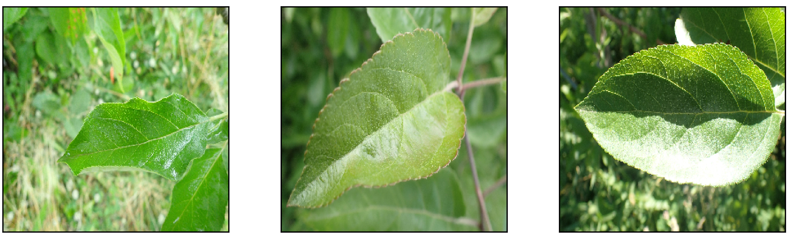

# ZeySed, A Deep Convolutional Neural Network for Detection of Plant Diseases

This study aims to classify plant leaves into three groups of (i) healthy, (ii) powdery mildew, and (iii) leaf rust. Images were taken from different plants are used to train and test the model. We propose ZeySed, a customized/tuned neural network that classifies the plant leaves images into these three classes.


# Classes
There are three classes in the dataset:
### Heahlthy

### Powdery

### Rust

# Model
We used a deep NN model to classify leaves into the three classes of Healthy, Powdery, and Rust. The structure includes three convolutional layers followed by three fully connected components.


## Clone the project
```bash
git clone https://github.com/ali-zeynali/ZeySed.git
```
```bash
cd ZeySed
```
## Prepare dataset
Download [dataset from this [LINK]](https://www.kaggle.com/datasets/rashikrahmanpritom/plant-disease-recognition-dataset) and place it at "dataset" folder.

## Report
Report is available from [FinalReport.pdf](FinalReport.pdf) file.
## Code
The code is written in Jupyter-notebook environment under Python 3.x version. Simpy run command below to open jupyter-notebook:
```bash
python -m notebook
```
then use Analysis.ipynb or Main.ipynb notebooks inside /Code/ directory to see the entire codes.

## Questions
Feel free to share your comments and thoughts regarding this project or ask me your question via my email address: "a" + __MY LAST NAME__ + "@umass.edu"